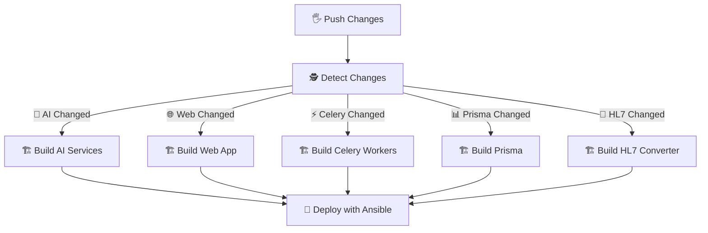

# 🚀 Nuvae's Magic Delivery Machine (CI/CD Pipeline)

Think of this pipeline as a **Magic Delivery Machine** 🪄 that builds, packs, and delivers our apps whenever changes happen.

---

## 🛎 When Does It Start Working?

**Fun version:**  
The machine wakes up whenever we push new code to certain places in our project.  

**Technical version:**  
Triggered on pushes to:
```yaml
branches:
  - dev
  - feature/*
  - bugfix/*
  - hotfix/*
````

This ensures the workflow runs for all active development, new features, bug fixes, and urgent patches.

---

## ⚙️ Step 1: Check What Changed 🕵️

**Fun version:**
Our detective robot looks for changes so it only works on stuff that’s new. No wasted effort! 🏃‍♂️💨

**Technical version:**

* Job: `detect-changes`
* Uses [`dorny/paths-filter`](https://github.com/dorny/paths-filter) to check for modified files.
* Detects changes in:

  * `apps/ai-services` → AI Services build
  * `apps/nuvae-web-app` → Web App build
  * `apps/workers` → Celery Workers build
  * `data/prisma` → Prisma build
  * `apps/hl7-to-fhir-converter` → HL7 Converter build

---

## 🏗 Step 2: Build the Pieces

**Fun version:**
Each app is built in its own “factory” so they don’t bump into each other. Each factory packs its product into a **Docker box** 📦.

**Technical version:**
Every build job:

* Checks out code (`actions/checkout@v3`)
* Sets up Docker Buildx (`docker/setup-buildx-action@v2`)
* Logs into Azure Container Registry (`docker/login-action@v2`)
* Generates metadata with `docker/metadata-action@v4`
* Builds and pushes Docker image with `docker/build-push-action@v4` (cache enabled)

---

### 🧠 AI Services Factory

**Fun:** Makes the brains of our system — the AI tools.
**Tech:**

* Copies Prisma schema to `apps/ai-services/prisma`
* Downloads `tiktoken` encoding files for AI processing
* Builds image from `apps/ai-services/Dockerfile`

---

### 🌐 Web App Factory

**Fun:** Builds the main shop where users visit.
**Tech:**

* Cleans tenants folder
* Passes environment variables for:

  * Auth config
  * Azure Storage
  * AI keys
  * Email server
  * Elasticsearch
* Builds image from `apps/nuvae-web-app/Dockerfile`

---

### ⚡ Celery Workers Factory

**Fun:** Little helpers that do background jobs.
**Tech:**

* Downloads and extracts `AVMC_RateSheets` from Azure Blob Storage
* Builds image from `apps/workers/Dockerfile`

---

### 📊 Prisma Factory

**Fun:** Takes care of our database’s “blueprints”.
**Tech:**

* Builds image from `data/prisma/Dockerfile`

---

### 🔄 HL7-to-FHIR Converter Factory

**Fun:** Converts one type of health data into another.
**Tech:**

* Sets up Java 17 (`actions/setup-java@v3`)
* Caches Maven dependencies
* Runs `mvn clean package`
* Builds image from `apps/hl7-to-fhir-converter/Dockerfile`

---

## 📤 Step 3: Send to the Big Warehouse 🏢

**Fun:** All our products (Docker images) go into our **cloud warehouse** so they can be shipped anywhere.
**Tech:** Azure Container Registry stores the built Docker images for deployment.

---

## 🚚 Step 4: Deliver to Customers (Deployment)

**Fun:** Our truck (Ansible) delivers the new apps to the “dev city”.
**Tech:**

* Installs Ansible
* Runs:

```bash
cd ./infra/ansible
ansible-playbook -i hosts.ini deployment.yml --limit development
```

---

## 🔍 How It Flows



---

## 🛡 Safety Tip

**Fun:** Don’t write the secret recipe on the box! Put it in a locked safe. 🔒
**Tech:** Move all hardcoded credentials (API keys, Azure keys, DB passwords) into **GitHub Secrets**.

---

## ✨ Why This is Awesome

* **Fun:** Fast, smart, and no wasted work.
* **Tech:** Modular builds, change detection, Docker caching, automated deployment, multi-service support.

